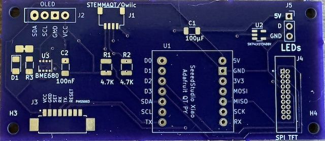
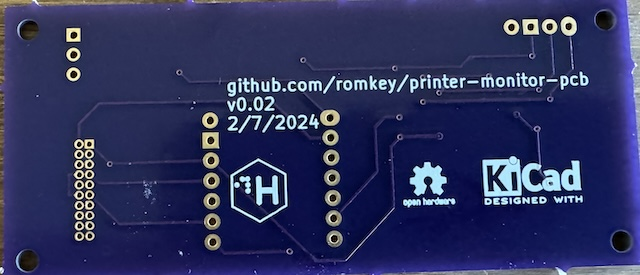

# PDX Hackerspace 3D Printer Monitor

This is a simple device for monitoring 3D printers.

It hosts a [SeeedStudio Xiao ESP32S3 Sense](https://www.seeedstudio.com/XIAO-ESP32S3-Sense-p-5639.html) CPU camera module so that its users can see the status of their prints.

It also can use a BME280 or BME680 for environmental (air temperature and humidity) monitoring, as well as a PMS5003 for air quality/particulate matter.

It includes an optional connection to an I2C display or a larger SPI-based RGB display, and can drive an addressable RGB LED strip for lighting.

## PCB

The PCB is designed using KiCAD. Hardware revisions are stored in the hardware directory.

You can [order this PCB from OSHPark](https://oshpark.com/shared_projects/bLoBvODi) but please don't order it. This project is under active albeit slow development. There will be a better version available soon.

Versions 0.02 and 0.03 are both 81x35 mm.

  

## Software

The board is intended to integrate with Home Assistant. ESPHome is the easiest way to build code for it. The repo contains an example ESPHome definition file at esphome.yml, which needs its display functionality fleshed out.

## OV5640

https://github.com/0015/ESP32-OV5640-AF

## PrusaLink

Status observed:
- finished
- idle
- busy
- attention
- printing

## Roadmap

Next hardware revision:

1. Center the Xiao ESP32S3 Sense camera module.
2. Rework the footprint of the Xiao ESP32S3 to allow either surface mount or through hole soldering.
3. Rework the SPI TFT connector to use a normal header block rather than the weird attempt at a cable connector it currently uses.
4. Consider adding hardware to support a PWM fan for air filtration.

